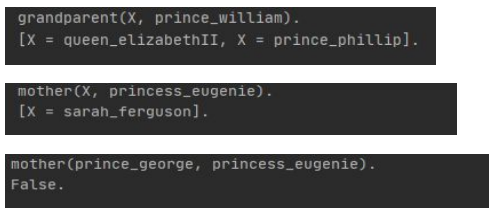

# Genealogy Query Model

Genealogy Query Model is a project built using Python and Prolog (specifically, SWI-Prolog). It implements a first-order logic model based on the foundation of forward chaining and backward chaining algorithms. This model is designed for answering or querying relationships in genealogy.

## Demo

## Installation

To use Genealogy Query Model, follow these steps:

1. Install SWI-Prolog on your system. You can download it from [here](https://www.swi-prolog.org/download/stable).
2. Clone this repository to your local machine: git clone <repository_url>
3. Install the required Python dependencies using pip: pip install -r requirements.txt

## Usage

Once Genealogy Query Model is installed, you can use it as follows:

1. Open a command prompt or terminal.
2. Navigate to the directory where you cloned the repository.
3. Run the Python scripts to interact with the model.

## Features

- Implementation of a first-order logic model for genealogy queries
- Utilizes forward chaining and backward chaining algorithms
- Designed for answering or querying relationships in genealogy

## Contributing

Contributions are welcome! If you have any ideas for improvements or new features, feel free to open an issue or submit a pull request.

## Acknowledgements

- Inspired by concepts in first-order logic programming
- Implemented in Python and Prolog (SWI-Prolog)
